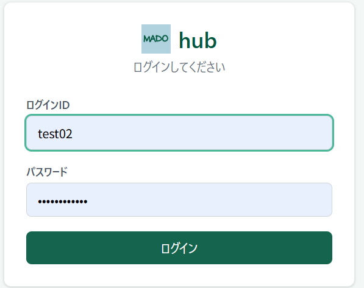
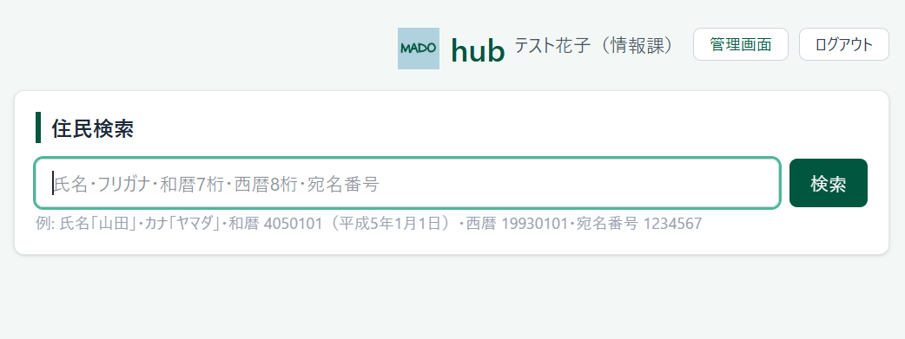
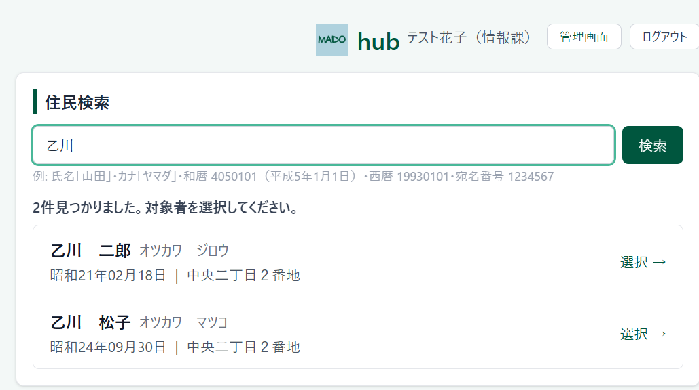
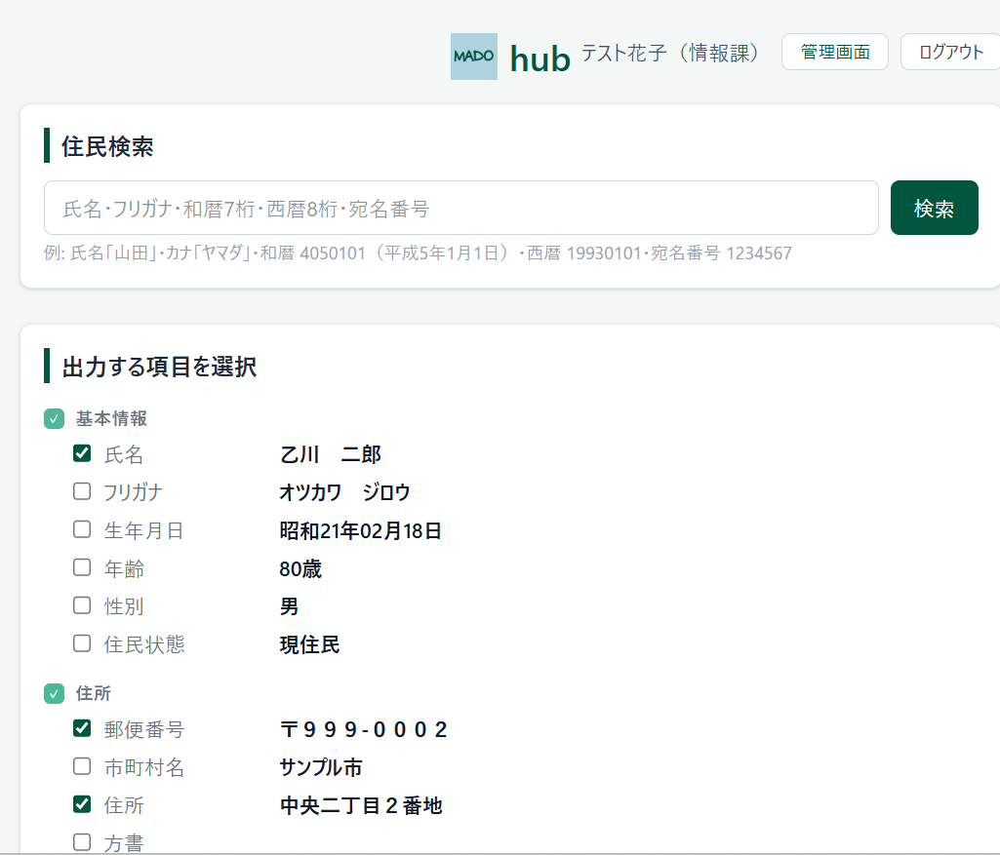
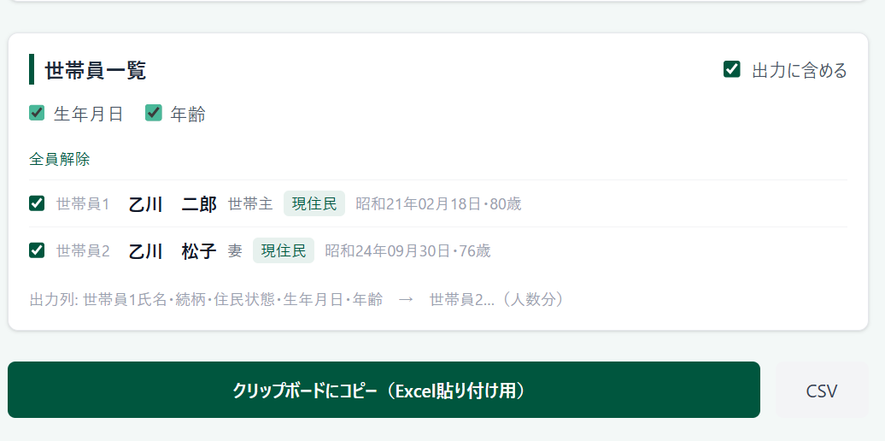
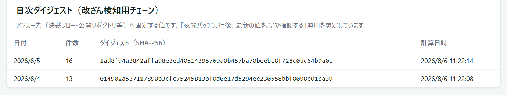
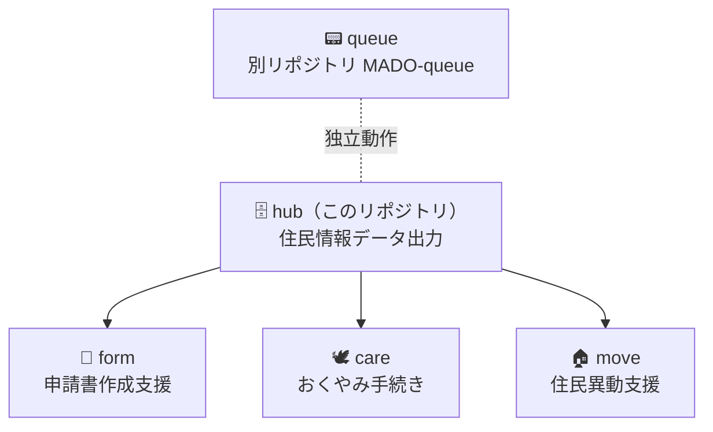

# MADO — Memuro Agile Desk Open

> An open-source counter service system built by and for small Japanese municipalities.

[](https://github.com/Memuro-Town/MADO-packages/actions/workflows/ci.yml)


> 窓口に来た住民が、名前を55回書く。
> その問題を、現場の職員が自分で作って解決した。

北海道芽室町が開発・運用している行政窓口業務支援システム **MADO** のOSS版。
中・大規模向けSaaSではなく、**小規模自治体が現場で使い続けられるLITE版**として設計している。

> 📦 **このリポジトリは MADO の `hub` / `form` / `care` / `move` を収めるリポジトリです。現在は `hub`（住民情報データ出力）のみを公開しています。**
> `form` / `care` / `move` は整備が済み次第、同じリポジトリの `packages/` 配下に順次追加する。
> `queue`（番号発券）だけは受付ネットワーク上で完全に独立して動くため、別リポジトリ [MADO-queue](https://github.com/Memuro-Town/MADO-queue) で公開している。全体像は [パッケージ構成](#パッケージ構成) を参照。

> 🧭 **MADO は役割ごとに4つのリポジトリに分かれている。**（📍現在地）
>
> | リポジトリ | 役割 |
> |---|---|
> | [Memuro-Town](https://github.com/Memuro-Town) | 組織トップ。全パッケージの公開状況はここが最新 |
> | [MADO](https://github.com/Memuro-Town/MADO) | なぜ作ったか・設計方針・議論の場（コードはありません） |
> | [MADO-queue](https://github.com/Memuro-Town/MADO-queue) | 実装：番号発券（受付ネットワーク・個人情報を扱わない） |
> | 📍 **MADO-packages（このリポジトリ）** | 実装：hub / form / care / move（閉じた庁内ネットワーク・住民情報を扱う） |

---

## Getting Started

`hub` は住民基本台帳データを検索し、必要な項目だけを選んで Excel やCSVに出力する庁内向けWebアプリ。北海道芽室町の窓口で**本番稼働中**。`form` / `care` / `move` が住民情報を受け取るための共通土台でもある。

**このリポジトリは実在の住民データを含まない。** 住民データベースは各自治体で用意する。外部レビュー・検証用に、**完全に架空**のサンプルデータセットを [`sample-data/`](sample-data/) に同梱している（11世帯27人・住民テーブル122列・個人番号は含まない）。

```bash
git clone https://github.com/Memuro-Town/MADO-packages.git
cd MADO-packages/packages/hub

cp .env.example .env             # POSTGRES_PASSWORD / SESSION_SECRET を書き換える（必須）
docker compose up -d postgres    # 開発用PostgreSQL（住民テーブルとusersテーブルを自動作成）

npm install
npx prisma generate
node scripts/create-user.mjs <ログインID> <氏名> <部署>   # 職員アカウント登録

node ../../sample-data/scripts/load-postgres.mjs   # 検証用の架空サンプルデータを投入（任意）
npm run dev                      # http://localhost:3010
```

`.env` を作る前に `docker compose` を実行すると、必須の環境変数が未設定で失敗する。順序に注意すること。
アカウントが1つもないとログインできず何も表示されない。詳しい手順・Dockerでの本番ビルドは [docs/DEVELOPMENT.md](docs/DEVELOPMENT.md) を参照。

> 💡 **Windows で WSL の Docker Engine を使う場合:** Postgres は WSL 内の `127.0.0.1:5432` にだけ公開される。上の手順（`npm install` / `npm run dev` など）も **WSL 側で実行する**こと。Windows 側で入れた `node_modules` を WSL で流用するとネイティブ依存で起動に失敗する。詳細は [docs/DEVELOPMENT.md](docs/DEVELOPMENT.md#windows--wsl-の-docker-engine-を使う場合) を参照。

> ⚠️ `npm run dev` / `npm start` は `-H 0.0.0.0` で待ち受ける。**起動したPCが接続しているLANの全端末からアクセスできる状態になる。** 庁内の別端末から使うための意図的な設定なので、閉じたネットワーク以外では絶対に起動しないこと。

---

## ドキュメント

本プロジェクトの詳細なドキュメントは `docs/` ディレクトリに集約されています。

* [ドキュメント一覧（Index）](docs/README.md) — 各種ドキュメントへのポータル
* [業務要件定義書](docs/REQUIREMENTS.md) — 解決したい課題、住民データベースの要件
* [システム設計書](docs/ARCHITECTURE.md) — 技術スタック、認証、権限設計、API
* [開発・環境構築ガイド](docs/DEVELOPMENT.md) — 環境構築、テスト、ハマりどころ
* [現場での使い方](docs/USE_CASES.md) — 窓口でどう使われ、なぜこの形なのか
* [配色規定](docs/DESIGN.md) — MADOファミリー共通のパレットと守るべきルール
* [導入自治体一覧](https://github.com/Memuro-Town/MADO/blob/main/FORKED_SITES.md) — MADOの稼働・フォーク実績（全パッケージ共通、MADOリポジトリで一元管理）
* [外部レビュー用サンプルデータ](sample-data/README.md) — 完全架空の検証データセット。カラム対応表（参考）、世帯パターン、投入手順
* [住民データ日次取込ツール](tools/csv_import/README.md) — 住基システムのCSV出力をPostgreSQLへ取り込む運用スクリプト（芽室町での実装例）

パッケージ固有の設定（`columns.json` によるカラム名マッピング等）は [packages/hub/README.md](packages/hub/README.md) にある。

---

## なぜ作ったか

### 住民が名前を55回書く問題

転入・婚姻と国保、障害者手帳などの手続きが重なると、住民は同じ書類に何度も同じ情報を書き込む。
MADOは住民情報を一度読み込み、各申請書に自動転記することでこの負担を解消する（`form` パッケージ）。
`hub` はその**入口**にあたる。住民を検索して必要な項目だけを取り出し、他のパッケージや Excel の様式に渡す役割を持つ。

### 転記のために職員が払っていたコスト

住民基本台帳システムの画面を見ながら、氏名・住所・生年月日を Excel の様式に手で打ち直す。この作業は時間がかかるうえ、打ち間違いが起きる。`hub` は必要な項目を選んでクリップボードにコピーするだけで済むようにした。

### 現場の職員が自分で作った

専門的なプログラミング知識のない窓口職員がAIを活用して開発した（Vibe Coding）。
基礎自治体の現場が開発した業務システムを、自治体公式OSSとして公開する。

### 芽室町の規模（参考）

同規模の自治体が導入を検討する際の目安として。人口・来庁者数などの数値は [MADO（プロジェクト憲章）](https://github.com/Memuro-Town/MADO#芽室町の規模参考)に掲載している。

---

## これは何か

| | MADO | 中・大規模向けSaaS |
|---|---|---|
| ターゲット | 小規模自治体（人口〜5万人程度） | 中・大規模自治体 |
| 導入コスト | ソフトウェアは無償（構築支援は別途） | 月額・初期費用あり |
| カスタマイズ | コードで自由に改変可 | ベンダー依存 |
| 設計思想 | 来庁者の不安解消・対話時間の確保 | 処理効率化 |

アナログとデジタルを組み合わせた設計。「速く処理する」より、システム導入により生まれる余力を「丁寧に寄り添う」窓口応対に充てることを優先している。

> ソフトウェア自体は無償だが、環境構築・DB設計・DB更新などが必要なため、構築支援の委託を想定している。

---

## 機能・画面構成（hub）

| URL | 説明 | 利用者 |
|-----|------|--------|
| `/login` | 職員ログイン | 全職員 |
| `/` | 住民検索・項目選択・出力 | 全職員 |
| `/admin/*` | ユーザー登録・権限グループ付与・期限の一括延長・操作記録の閲覧 | `admin` ロールのみ |

一般の職員が使う画面は `/login` と `/` の2つだけ。`admin` ロールのユーザーだけが `/admin` 配下の管理画面を利用できる（`proxy.ts` でロール判定）。`/` は未ログインだと `/login` にリダイレクトされ、APIは401を返す。認証は `proxy.ts` が全経路で行う。管理画面の詳細は [packages/hub/README.md](packages/hub/README.md#管理画面) を参照。

主な機能：

- **住民検索** — 氏名・フリガナ（ひらがな入力可）・生年月日（和暦7桁／西暦8桁）・宛名番号を入力欄1つで自動判別
- **項目選択** — 氏名・住所・本籍・世帯主など、出力したい項目だけをチェックで選ぶ
- **世帯員一覧** — 同一世帯の構成員を表示し、出力に含める人を個別に選べる
- **カスタム列** — 許可リストの範囲内で、DBの任意の列を最大5つまで追加できる
- **出力** — クリップボード（タブ区切り、Excelに直接貼り付け）またはCSV（BOM付き）
- **カラム名設定** — `columns.json` を差し替えるだけで異なるDB構造に対応する

| ログイン | 住民検索 |
|---|---|
|  |  |



**初めて触る方:** このシステムが何のためにあるか・現場でどう使われるかは [docs/USE_CASES.md](docs/USE_CASES.md) から読むと分かりやすい。

---

## 窓口での使われ方

`hub` は、自席で1件だけ手早く調べたい場面を想定している。**ページ遷移を挟まず、検索から出力までを1画面で完結させる**のはそのためである。

**通知や案内の宛名を作る** — 対象者を検索し、「氏名」「郵便番号」「住所」にチェック（初期状態で選択済み）。コピーして Excel の差し込み用シートに貼る。列名を含めるチェックは1回出力すると自動でオフになるため、2人目以降を続けて貼っても列名が混ざらない。



**世帯構成の確認** — 対象者の詳細を開くと、同一世帯の構成員が記載順位の順に一覧表示される。出力に含める世帯員を個別に選べるので、必要な人だけを1行に横並びで出せる。本籍・戸籍筆頭者も項目として選択できる。



**定型項目にない情報が必要になったとき** — 住民テーブルには100列以上あるが、画面の定型項目はその一部にすぎない。許可リストに載っている列に限り、「カスタム列」から最大5つまで追加して出力できる。

より詳しい典型例は [docs/USE_CASES.md](docs/USE_CASES.md#2-典型的な使われ方) にまとめてある。

### 設計のいくつかの「なぜ」

- **和暦7桁で生年月日を入力できる** — 行政の現場では生年月日を「元号コード1桁＋年2桁＋月2桁＋日2桁」の7桁で扱う場面が多い（例: `4050101` = 平成5年1月1日）。西暦に読み替えてから入力させると読み替えの手間と間違いが増えるため、そのまま打てるようにしている
- **検索欄が1つしかない** — 「氏名で検索」「生年月日で検索」とタブを分けると、職員は毎回どのタブかを選ぶ必要がある。窓口で住民を待たせながらの操作ではこれが邪魔になるため、入力内容から検索方法を自動判定する形にした
- **転出者・死亡者のバッジをあえて強い配色にしている** — 検索結果には転出者・死亡者・消除者も出る。同姓同名や世帯内の類似氏名で別人を選んでしまう事故を防ぐ必要があるため。MADOの配色規定では強調に赤を使わないが、このバッジだけは例外にしている

残りの設計判断（検索結果を50件で打ち切る理由、クリップボードを主にした理由など）も含めて [docs/USE_CASES.md](docs/USE_CASES.md#3-設計のなぜ) に書いてある。

---

## セキュリティと監査

`hub` は住民基本台帳のデータを扱う。ベンダー製パッケージであれば当然に講じられている安全策を、内製である以上は自分たちで設計し、責任の範囲を決める必要があった。導入を検討する際に最初に確認されるであろう点を、ここにまとめておく。

| 観点 | 現在の実装 |
|---|---|
| ネットワーク | 閉じた庁内ネットワーク前提。インターネットに公開する設計ではない。芽室町では三層分離のうち**個人番号利用事務系**に設置している |
| 認証 | ID＋パスワード（`bcryptjs` でハッシュ）。JWTセッション（`jose` / HS256）で絶対期限12時間、無操作時は自動失効。`proxy.ts` が**全経路をゲート**し、未ログインでは画面もAPIも一切通さない（APIは401） |
| 権限 | 権限グループで、住民テーブル100列以上のうち**閲覧してよい列だけ**に絞る。カスタム列APIは `information_schema.columns` と権限グループの**二重検証**を通す |
| 権限の期限 | 付与に期限を設け、管理画面から一括延長・取消・臨時例外の付与ができる。**人事異動に伴う権限の切り替え**を運用でなく仕組みで扱うため |
| 監査ログ | 3つのテーブルに分けて記録する。`audit_log`（住民情報の検索・閲覧）／`admin_audit_log`（管理画面での操作）／`daily_digests`（改ざん検知用の日次ダイジェスト） |
| 改ざん検知 | 1日分のログをまとめたハッシュ値を日次ダイジェストとして保存。加えて **pgAudit** で PostgreSQL 層の SQL を記録し、アプリを経由しない直接操作も捕捉できるようにしている |
| 個人番号 | **列そのものを持たせていない。** 値が空なのではなく、スキーマ・サンプルデータ・DDLのいずれにも存在しない。日次取込スクリプト側でもCSVから明示的に除外する |
| 他の識別番号 | `基礎年金番号`・`在留カード等番号` は列としては存在するが、権限グループの許可リストに含めていないため参照できない |

日次ダイジェストは管理画面（住民情報 閲覧記録）から確認できる。夜間バッチ実行後、その日の分がチェーンに積み上がっていく（下図はテストデータでの実行例）。



**検索は「特定」までで、「抽出」はできない。** `hub` にあるのは1人を特定するための検索であり、「特定の年齢層を全員出す」といった条件抽出・範囲検索の機能は持たせていない。検索結果も50件で打ち切る。

**このリポジトリの公開範囲について。** 公開しているのはコードと**完全に架空の**サンプルデータのみで、実在の住民データはもちろん、ネットワーク構成などの運用情報も含まない。コードが公開されていることと、データが安全に扱われていることは別の話であり、後者は各自治体が自らの情報セキュリティポリシーに照らして判断する必要がある。

設計の詳細は [docs/ARCHITECTURE.md](docs/ARCHITECTURE.md#認証)、運用手順は [packages/hub/README.md](packages/hub/README.md#監査ログ) を参照。**解決できていない点は次節に書いた。**

---

## できないこと・制限

`hub` は万能ではない。

- **`hub` アプリ自体は住民データの取り込み機能を持たない。** 住民基本台帳システムからDBへの投入は独立したツール（[`tools/csv_import`](tools/csv_import/README.md)、芽室町での実装例）で行う。他自治体はCSV出力仕様に合わせて調整が必要
- **権限グループは今のところ1種類しかない。** 期限つきの個人単位の権限付与・取消・臨時例外を管理画面から行える仕組みはあるが（[packages/hub/README.md](packages/hub/README.md#権限グループ)）、現状定義されているグループは「基本グループ（住民基本情報）」のみで、部署・業務単位であらかじめ見える範囲を分けた運用にはなっていない。宛名番号を鍵に別テーブルとして他の情報（保険や受給者情報、税の賦課情報等）を拡張することは構造上可能であるが、権限設定の検討を要するため芽室町でも導入していない。現状、住基の照会画面で取得できる情報のみに制御している（詳細は [docs/ARCHITECTURE.md](docs/ARCHITECTURE.md#住民テーブル)）
- **出力操作（クリップボードへのコピー・CSV保存）は監査ログに残らない。** ブラウザ側で完結する操作でサーバにリクエストが来ないため、現在の実装では記録できない。ログに残るのは「誰がいつ何を検索したか」（`resident.search`）と「誰がいつどの住民・世帯の詳細を開いたか」（`resident.view`／`household.view`）までで、開いた後に何を出力したかまでは追えない
- **アクセス制御は列単位のみで、行単位の制限がない。** 「どの項目を見せるか」は権限グループで制御できるが、「どの住民を見せないか」は制御できない。DV等支援措置の対象者のように参照そのものを制限すべきケースは、運用と事後の監査で担保するほかない
- **監査ログのテーブル自体が個人情報を含む。** `audit_log` の検索クエリには住民の氏名等が平文で入る。アクセス制御・保持期間・削除やアーカイブの運用は導入自治体が定める必要がある
- **検索結果は50件で打ち切る。** 「佐藤」のような姓では全件を返さず、絞り込んでの再検索を促す

詳細は [docs/USE_CASES.md](docs/USE_CASES.md#4-導入時に決める必要があること) と [docs/ARCHITECTURE.md](docs/ARCHITECTURE.md#権限設計の現状と限界) を参照。

---

## パッケージ構成



`hub` は閉じた庁内ネットワーク上で動作し、住民情報を扱う（芽室町では三層分離のうち**個人番号利用事務系**に設置している）。`form` / `care` / `move` は `hub` に依存するため、同じリポジトリの `packages/` 配下に順次追加していく。
`queue` は受付ネットワーク上で独立して動作し、住民の個人情報を一切扱わない。ネットワークもコードも分離しているため、別リポジトリ [MADO-queue](https://github.com/Memuro-Town/MADO-queue) で公開している。
各パッケージの最新の公開状況は [Memuro-Town organizationトップ](https://github.com/Memuro-Town) を参照。

### ディレクトリ構成

```
MADO-packages/
├── packages/
│   └── hub/          住民情報データ出力（form / care / move を順次追加）
├── sample-data/      外部レビュー・検証用の完全架空データセット（4パッケージ共通）
│   ├── csv/            主資料。人間がレビューしやすい形式
│   ├── prisma/         schema.prisma に対応した seed データ
│   └── scripts/        CSV → PostgreSQL / SQLite 投入スクリプト
├── tools/            庁内の運用ツール（Python。hubアプリ本体とは別に単体で動く）
│   └── csv_import/     住基システムが出力するCSVをPostgreSQLへ日次で取り込むスクリプト
├── data/             各自治体の住民DBの置き場。中身はコミットしない
└── docs/             プロジェクト全体のドキュメント
```

[`sample-data/`](sample-data/) は `packages/` と同列に置いている。`hub` 専用ではなく、後から加わる `form` / `care` / `move` でも使う共通の資産として扱うため。
[`data/`](data/) は各自治体が用意する住民データベースの置き場で、`.gitignore` により中身は一切コミットされない。

> この配置は [Memuro-Town/MADO#4](https://github.com/Memuro-Town/MADO/issues/4) でコントリビューターから提案された構成にもとづく。

---

## 技術スタック

### hub（このリポジトリ）
- **Framework**: Next.js 16（App Router）
- **Language**: TypeScript 5 / React 19
- **Database**: PostgreSQL 16（Prisma 5 経由。**SQLiteから移行済み**）
- **認証**: JWTセッション（`jose` / HS256・12時間）＋ パスワードハッシュ（`bcryptjs`）
- **スタイル**: Tailwind CSS v4
- **テスト**: vitest
- **実行環境**: Node.js 20 / Docker（`node:20-alpine`）
- **ブラウザ**: Chrome / Edge（最新版）

### form / care / move（同リポジトリに順次追加）
- **Framework**: Next.js (App Router) / **Language**: TypeScript

### queue（別リポジトリ）
- **Framework**: Flask 3.x / **Language**: Python 3.14 / **Database**: SQLite

> `hub` は当初 SQLite で動いていたが、複数職員からの同時接続と住民データの規模を踏まえて PostgreSQL に移行した。移行の経緯は [docs/ARCHITECTURE.md](docs/ARCHITECTURE.md) を参照。

---

## 3者の価値創造

芽室町・参画自治体・エンジニアやベンダーそれぞれにとっての価値は [MADO（プロジェクト憲章）](https://github.com/Memuro-Town/MADO#3者の価値創造)にまとめている。

---

## 現在の状況と求めること

MADOは「解決したい課題は明確だが、技術力がない」という現場の職員がAIを活用して開発した（Vibe Coding）。窓口業務での実用には耐えているが、コードの品質・設計・テストの面では未成熟な部分が多い。

**現場が作ったプロダクトを、エンジニアコミュニティと一緒に育てたい。** 特に以下の点で力を借りたい：

- **権限グループの設計と運用** — 期限つきの個人単位の権限付与・監査ログの仕組み自体はある（[packages/hub/README.md](packages/hub/README.md#権限グループ)）が、部署・業務単位でどうグループを切るかは自治体ごとの判断が必要で、現状は「基本グループ」1種類しか定義していない。導入自治体の業務実態に合わせたグループ設計の相談・提案を歓迎する。出力操作（クリップボードへのコピー・CSV保存）が監査ログに残らない点も未解決（[docs/ARCHITECTURE.md](docs/ARCHITECTURE.md#権限設計の現状と限界) に現状と限界を書いた）
- コードレビュー・リファクタリング
- DB設計の見直し（場当たり的な実装で、将来の拡張性が考慮できていない）
- テスト設計・自動化
- セキュリティ観点での確認
- 他自治体が導入しやすくなるための設計改善

行政ドメインの現場知識はこちらにある。技術的な知識を持つ人と組み合わさることで、より多くの自治体で使えるシステムになると考えている。

---

## Contributing

→ [CONTRIBUTING.md](CONTRIBUTING.md)

バグ報告・ドキュメント修正・設計議論、どこからでも歓迎する。各自治体の固有仕様はフォークで自由に派生してよい。**まず Issue（リポジトリ上部の "Issues" タブ）で話しかけてほしい。**

メンテナーは非エンジニアの現場職員であるため、起票内容を読み解くのに時間がかかることがある。また個人情報を扱うシステムの性質上、変更内容によっては庁内での慎重な検討を要する場合がある。そのため、採否等の連絡が遅くなることがある（**1か月以上かかる場合がある**）。あらかじめご了承いただきたい。

行動規範は [CODE_OF_CONDUCT.md](CODE_OF_CONDUCT.md)、脆弱性の報告は [SECURITY.md](SECURITY.md) を参照。

---

## 導入自治体

→ [MADO/FORKED_SITES.md](https://github.com/Memuro-Town/MADO/blob/main/FORKED_SITES.md)（全パッケージ共通の一覧。プロジェクト全体の入口リポジトリで一元管理している）

---

## License

MIT License — Copyright (c) Memuro Town

詳細は [LICENSE](LICENSE) を参照。

本リポジトリのコードは参考実装であり、各自治体での法令適合性・業務適合性は導入主体が確認すること。**特に `hub` は住民の個人情報を取り扱う。導入にあたっては各自治体の情報セキュリティポリシーに照らした評価を必ず行うこと。**

---
