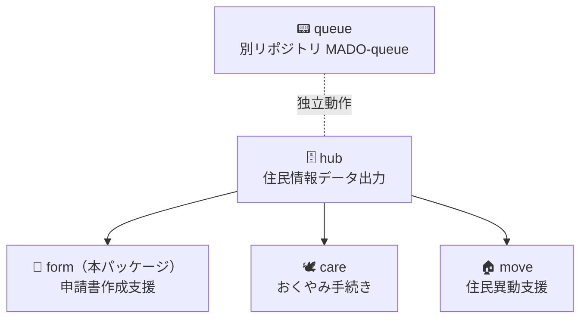
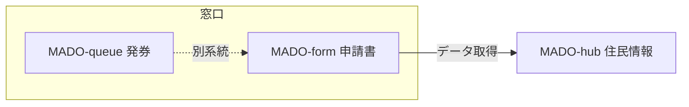

# MADO-form

> **このパッケージは設計段階の議論型公開です。コードはまだ含まれません。**

hub で取り出した住民情報を、窓口の流れに合わせて見やすく並べ、申請書・証明書の作成を支援する。

---

## MADO の中の位置

`queue`（発券）→ `hub`（住民情報）→ **`form`（申請書）** → `care` / `move`。  
`form` は `hub` に依存する。`queue` は受付ネットワーク上の別系統で、個人情報を扱わない。

全体の入口は [MADO-packages の README](../../README.md)。`hub` の使い方は [packages/hub/README.md](../hub/README.md)。番号発券は [MADO-queue](https://github.com/Memuro-Town/MADO-queue)。

---

## いまの状態

- **OSS 版にアプリのコードはない。** このフォルダは設計の議論用である
- 芽室町の庁内では、Python デスクトップ版が窓口で動いている。これは参考実装であり、このリポジトリに出すものではない
- これから議論して設計を固める。完成品を公開する段階ではない

---

## この実験（第1段）

完成してから出すのではなく、**設計を先に外と議論する**試行である。対象は `form` だけである。`queue` / `hub` の「動くコードができてから公開する」方針は変えない。

### 第1段のルール

- いま優先するのは、設計・方向の議論である
- 個人情報・具体の住民例は書かない
- 答えが先に決まっているように書かない。現場で分かれるところを残す
- **コードの Pull Request の締め切り日は設けない。** いま求めているのはコメントである。窓口の流れと hub 揃えの方向が見えた段階で、小さなコード提案も歓迎する
- 議論のあと、一定期間コントリビューションがなければ、メンテナー側で実装に着手する
- **第2段（実装）は別の Issue にする。** 第1段の Issue は設計議論の台帳として残し、方針が見えたら要約してから閉じる
- 
### 集中して聞きたい期間（目安）

合意の締切ではない。コメントの優先案内である。

| 期間（目安） | 主に聞きたいこと | Issue の見出し |
|---|---|---|
| **最初の約1週間** | 窓口の流れ・分岐・判断 | 「窓口の流れについて」 |
| **続く約1週間** | 技術寄りの設計（`hub` との揃え・責務の境界）。**実装のやり方は決めない** | 「hub との揃えについて」 |

期間を過ぎてもコメントは歓迎する。方向が見えていれば、その後のコード提案も歓迎する。

---

## 窓口の流れ

操作の手順書ではない。**分岐と判断のポイント**だけを書く。一町のやり方を仕様にしない。

番号発券（`queue`）とのつなぎは別系統なので、ここでは扱わない。

### 証明書・住民票を作るとき

現場では、おおむね次の単位で進む。**この順番自体が議論の対象である。**

1. 用件を聞く
2. 本人確認
3. 対象者を検索する
4. 同一世帯かどうかを見る
5. この窓口で出してよいかを判断する
6. 記載事項を確認する
7. 申請書に流して印刷する。手書きで残す欄があれば残す

### 議論したいこと（複数・未確定）

答えは書かない。現場のやり方が町によって分かれるところだけを列挙する。

1. **発行の判断タイミング** — 証明書をこの窓口で出してよいかの判断は、検索の前・後・途中のどこか。そのとき見ている情報は何か
2. **同一世帯／別世帯** — 用件のとき、本人確認のとき、検索のあと、どのタイミングで確認しているか
3. **本籍の出し方** — 検索してすぐ出すか、記載事項や帳票の段階で出すか
4. **記載の聞き方** — 本籍・筆頭者、世帯主・続柄、個人番号、住民票コードの有無を、項目確認で聞くか、用途から決めるか、既定値を置いて確認するか。「普通ので」「全部入れといて」と言われたときの返し方
5. **画面と手書きの境** — 申請書のうち、画面で埋めてよい欄と、手書きで残す欄はどこか
6. **本人確認の位置** — 本人確認書類の提示は、検索や発行判断の前か後か
7. **代理人・第三者** — 委任状、印鑑、第三者請求を、画面の分岐にするか、職員判断のままにするか
8. **戸籍・広域交付** — 住民票の申請書作成と同じ流れに乗せるか、途中で別系統・口頭案内に切り離すか

対象者の特定は、多くの窓口で **生年月日の検索** が基本である（本町もそうである。日本人は和暦7桁、外国人は西暦8桁、といった型がある）。`hub` は7桁・8桁の両方で検索できるため、桁や暦の切り替え自体は第1段の論点にしない。

### 状態の表示（任意・後半）

転出・死亡・消除などの状態表示を、窓口でどう使っているか。

---

## hub と揃える必要がある理由

庁内の `form` は Python デスクトップ、`hub` は Web（Next.js）と PostgreSQL である。`form` が `hub` の住民データ取得を使うには、作り方を揃える必要がある。

**揃える論点（未決）。第1段では実装方針を決めない。**

- Web にするかどうか
- API の呼び方
- 認証と権限
- ネットワーク（個人番号利用事務系）
- 申請書支援から、基幹の照会画面へのつなぎをどこまで設計の対象にするか

庁内で先に揃え作業はしない。この議論を経てから実装する。

---

## 議論の場

議論の台帳は **このリポジトリの GitHub Issue** である。<!-- 起票後に URL を入れる -->

現場の流れについてのコメントも、Issue に直接書いてよい。コードの知識は不要である。既存のコントリビューターからの質問・確認も歓迎する。

あわせて、自治体職員向けコミュニティでも呼びかける。そこでの議論は GitHub を開かない人向けの入口であり、**すべてを自治体職員向けコミュニティに限るわけではない。**

Issue では、現場の話は「窓口の流れについて」、hub とのつなぎの話は「hub との揃えについて」の下にコメントしてほしい。

### 誰に聞きたいか

| 誰 | 第1段 |
|---|---|
| 現役の窓口担当 | **主役。** 現場の流れと判断だけでよい |
| 窓口に詳しい元SE（職員） | 壊してはいけない操作、`hub` 連携で困る分岐 |
| エンジニア | 質問・確認・補足は歓迎。現場でのフローを捉えてもらいたい。方向が見えたあとの小さなコード提案も歓迎 |

---

## リンク

- [MADO-packages（このリポジトリ）](../../README.md)
- [MADO-hub](../hub/README.md)
- [MADO-queue](https://github.com/Memuro-Town/MADO-queue)
- [MADO（なぜ作ったか）](https://github.com/Memuro-Town/MADO)

License はリポジトリ全体と同じ [MIT](../../LICENSE) である。
