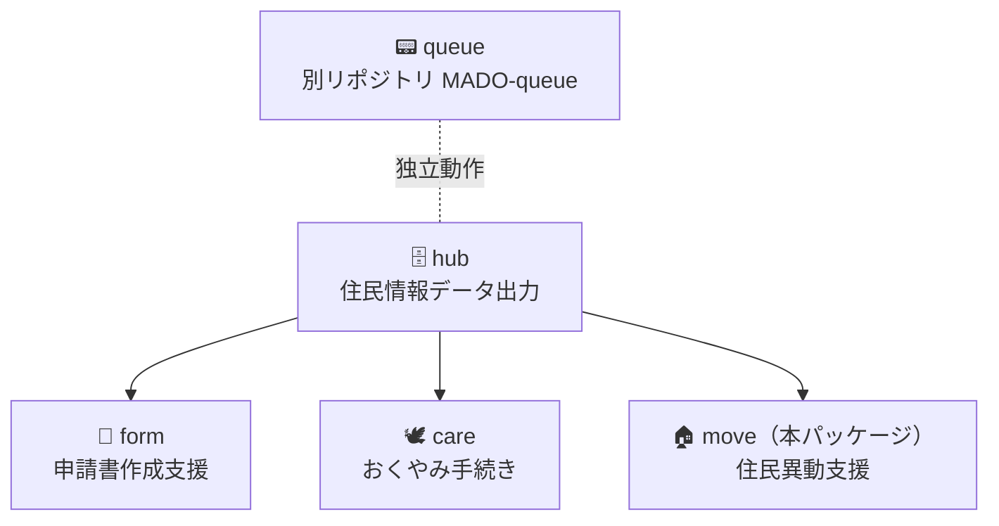

# MADO-move

> **このパッケージは場所だけ先に置いています。コードはありません。Issue も Pull Request も、まだ受け付けていません。**

転入・転出などの異動に必要な基本情報を整理し、帳票の作成を支援する。

---

## MADO の中の位置

`queue`（発券）→ `hub`（住民情報）→ `form`（申請書）→ **`move`（住民異動）** / `care`。  
`move` は `hub` に依存する。`queue` は受付ネットワーク上の別系統で、個人情報を扱わない。

全体の入口は [MADO-packages の README](../../README.md)。`hub` は [packages/hub/README.md](../hub/README.md)。申請書は [packages/form/README.md](../form/README.md)。番号発券は [MADO-queue](https://github.com/Memuro-Town/MADO-queue)。

---

## いまの状態

- **OSS 版にアプリのコードはない。** このフォルダはパッケージの居場所である
- 芽室町の庁内では、窓口で使っている。これは参考実装であり、このリポジトリに出すものではない
- 設計の問いは、まだここには書かない

---

## 窓口の流れ

操作の手順書ではない。いま書いているのは段階の骨格だけである。一町のやり方を仕様にしない。

番号発券（`queue`）とのつなぎは別系統なので、ここでは扱わない。

1. 異動する人を特定する
2. 異動の種類に沿って、基本情報を整理する
3. 帳票へ、取れる項目を流す

---

## hub との関係

`move` は `hub` の住民情報を使う。揃え方の議論は、このパッケージではまだ開かない。

---

## まだ受け付けないこと

このパッケージについての **Issue**、**Pull Request**、**議論**は、まだ受け付けていません。

準備ができてから、この README で案内します。

---

## リンク

- [MADO-packages（このリポジトリ）](../../README.md)
- [MADO-form](../form/README.md)
- [MADO-hub](../hub/README.md)
- [MADO-queue](https://github.com/Memuro-Town/MADO-queue)
- [MADO（なぜ作ったか）](https://github.com/Memuro-Town/MADO)

License はリポジトリ全体と同じ [MIT](../../LICENSE) である。
